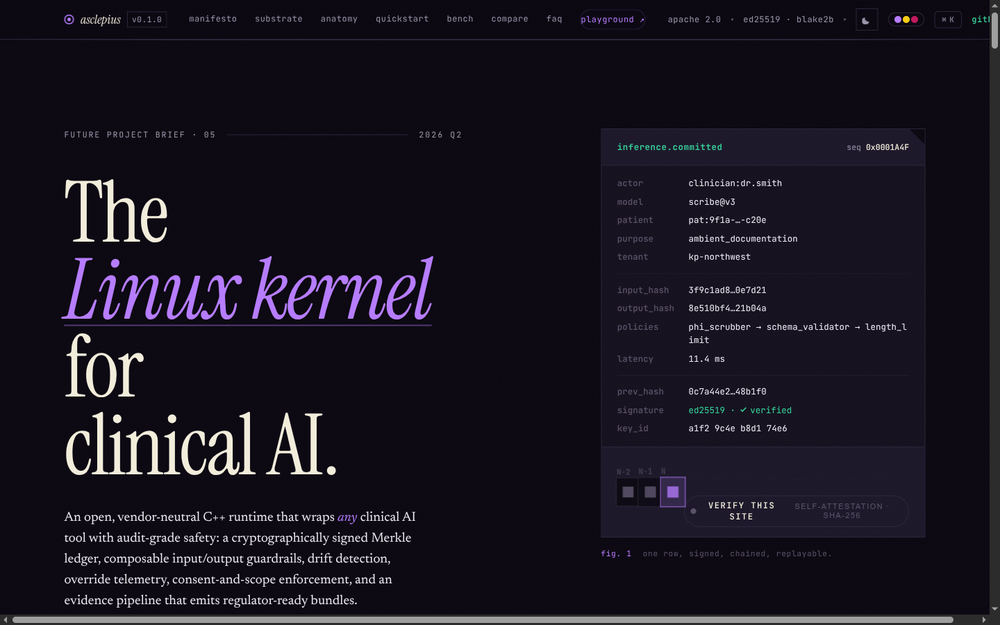
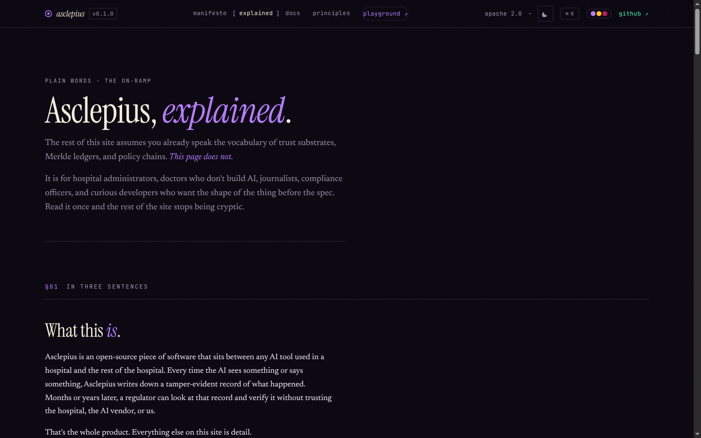
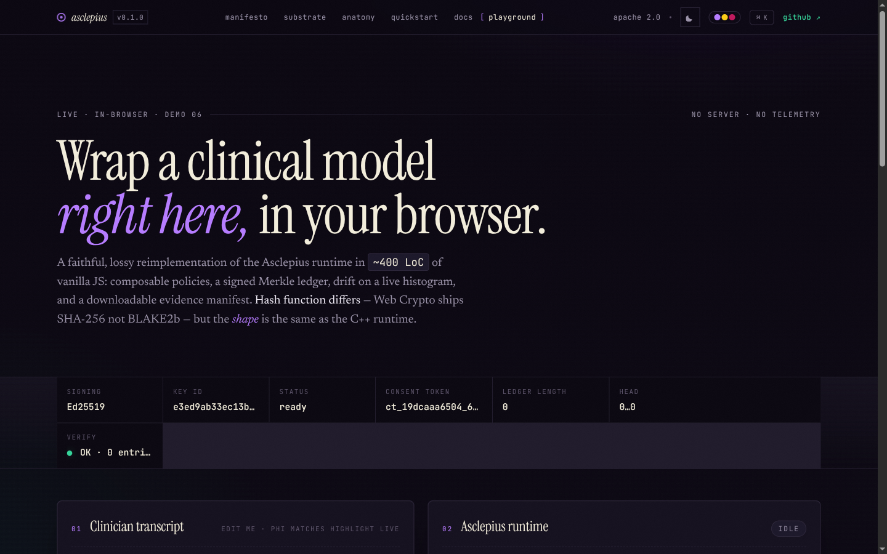
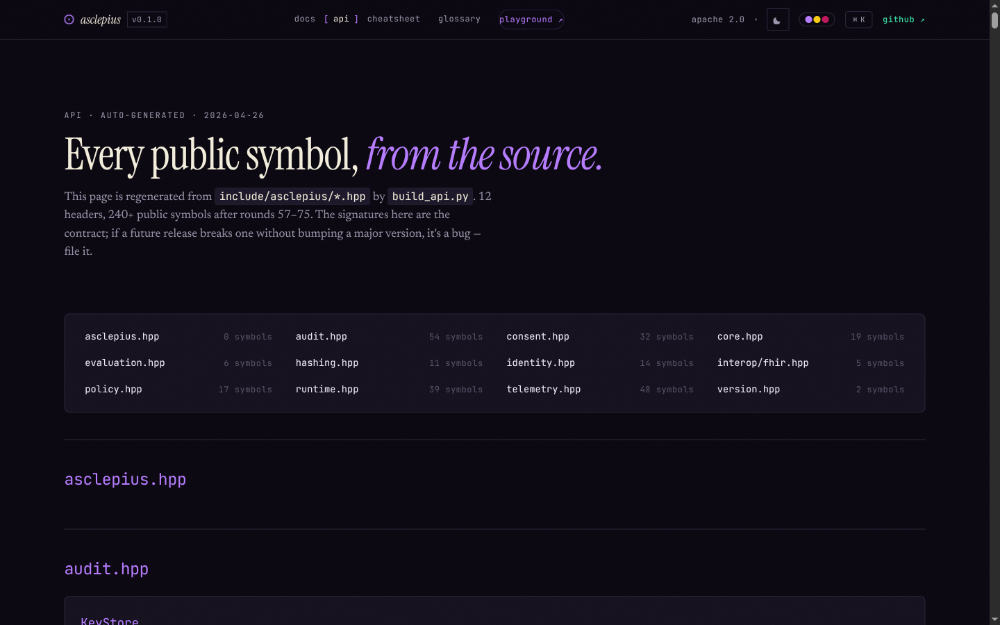
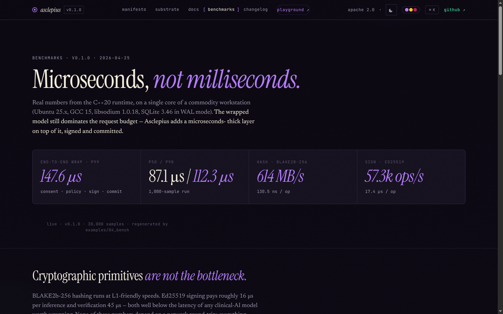
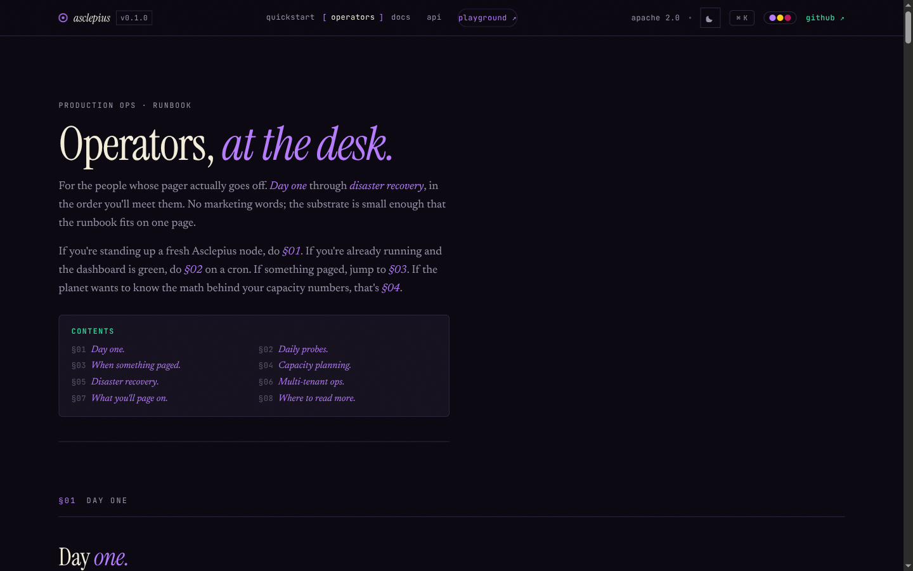
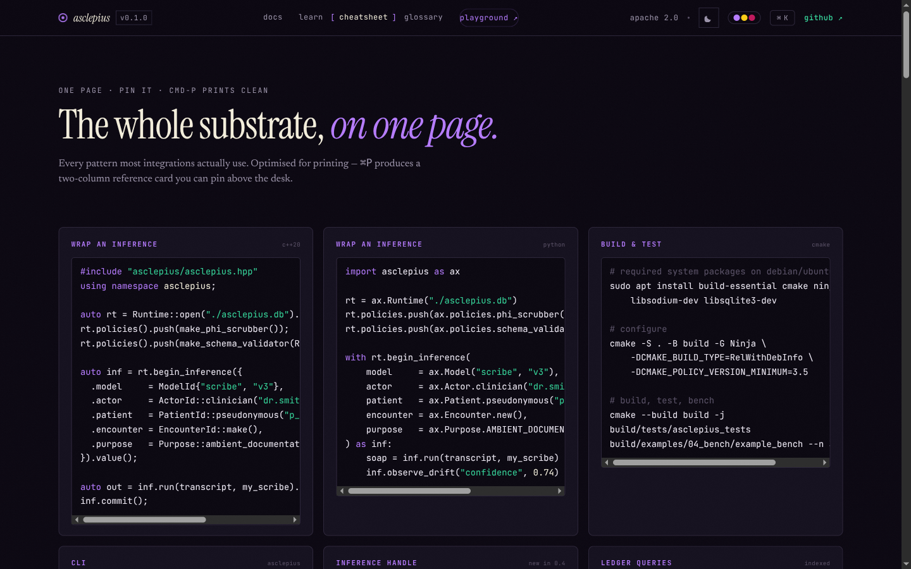

# Asclepius

> A trust substrate for clinical AI. *"The Linux kernel for clinical AI."*

Asclepius is an open, vendor-neutral C++20 runtime that wraps any clinical AI
tool with audit-grade safety: composable input/output guardrails, a
cryptographically signed Merkle ledger, drift detection, override telemetry,
consent-and-scope enforcement, and an evidence pipeline that emits regulator-
ready bundles.


<p align="center">
  <a href="site/index.html">
    
  </a>
</p>

<p align="center">
  <a href="#screenshots-tour">screenshots</a> ·
  <a href="#what-is-asclepius-in-plain-words">what is this</a> ·
  <a href="site/quickstart.html">quickstart</a> ·
  <a href="site/api.html">api</a> ·
  <a href="site/demo.html">playground</a> ·
  <a href="#build">build</a>
</p>

---

## Screenshots tour

The product website is a single-file static site (HTML + CSS + vanilla JS, no
build step) under [`site/`](site/). Click any preview to open the source page
in this repo; click the heading link to read its rendered counterpart.

<table>
<tr>
<td width="38%" valign="top">

### [§01 — Landing](site/index.html)

The hero pairs a manifesto with the *anatomy of a wrapped inference*. Every
field on the right — `input_hash`, `output_hash`, `prev_hash`, `signature`,
`key_id` — is a real column that the C++ runtime emits to the Merkle
ledger. Read‑only on this page; the [playground](site/demo.html) makes it
live.

</td>
<td width="62%">

<a href="site/index.html"></a>

</td>
</tr>

<tr>
<td width="62%">

<a href="site/explained.html"></a>

</td>
<td width="38%" valign="top">

### [§02 — Explained](site/explained.html)

For hospital admins, doctors who don't build AI, journalists, compliance
officers. Nine sections: *the problem*, *what it does*, *who it's for*,
*why this layer*, *what you actually get*, *what it is not*, *a 30-second
use case*, *where to go next*. No vendor jargon.

</td>
</tr>

<tr>
<td width="38%" valign="top">

### [§03 — Playground](site/demo.html)

~400 LoC of vanilla JS that reimplements the runtime in the browser:
composable policies, a signed Merkle ledger, live PSI on a histogram,
downloadable evidence manifest. **Hash function differs** — Web Crypto
ships SHA-256, not BLAKE2b — but the *shape* matches the C++ runtime
exactly.

</td>
<td width="62%">

<a href="site/demo.html"></a>

</td>
</tr>

<tr>
<td width="62%">

<a href="site/api.html"></a>

</td>
<td width="38%" valign="top">

### [§04 — API reference](site/api.html)

Every public symbol in `include/asclepius/*.hpp`, regenerated from source
by `build_api.py`. 240+ entries across 12 headers (audit, consent, core,
evaluation, hashing, identity, interop, policy, runtime, telemetry,
version). The signatures are the contract.

</td>
</tr>

<tr>
<td width="38%" valign="top">

### [§05 — Benchmarks](site/benchmarks.html)

Real numbers from the C++20 runtime on a single core of a commodity
workstation. **147.6 µs** end-to-end p99, **614 MB/s** BLAKE2b‑256, **57.3k
ops/s** Ed25519. Live‑bound to [`site/assets/bench.json`](site/assets/bench.json),
regenerated by `examples/04_bench`.

</td>
<td width="62%">

<a href="site/benchmarks.html"></a>

</td>
</tr>

<tr>
<td width="62%">

<a href="site/operators.html"></a>

</td>
<td width="38%" valign="top">

### [§06 — Operators](site/operators.html)

The runbook for the people whose pager actually goes off. Eight sections,
day-one → disaster recovery: deploy checklist, daily probes (cron sketch),
incident response, capacity math, multi-tenant ops, what you'll page on,
where to read more.

</td>
</tr>

<tr>
<td width="38%" valign="top">

### [§07 — Cheatsheet](site/cheatsheet.html)

The whole substrate, on one page. Every pattern most integrations actually
use — wrap an inference (C++ + Python), build & test, CLI, ledger queries,
inference handle, runtime introspection, consent. Optimised for printing;
`⌘P` produces a clean two-column reference card.

</td>
<td width="62%">

<a href="site/cheatsheet.html"></a>

</td>
</tr>
</table>

> Run the site locally to make all of the above interactive:
>
> ```sh
> cd site && python3 -m http.server 8765
> # → http://localhost:8765
> ```

---


It is the substrate, not the app. It does not care if the wrapped tool is a
GPT-class scribe, a radiology CNN, an internal LLM agent, or rule-based CDS —
any clinical AI inference becomes auditable, rate-limited, schema-checked,
consent-aware, and replayable through one runtime.

## What is Asclepius? (in plain words)

Hospitals are starting to use AI for real clinical work — ambient scribes that
write SOAP notes from a recorded visit, models that suggest a likely diagnosis,
triage tools that flag the sickest patients first. When one of those tools
gets something wrong, nobody can answer the basic forensic questions: what
exactly did the AI say, what was it shown, who approved its use that day, did
the patient consent, was the model behaving the way it was last month? The
record is missing, or it lives in a vendor's logs that nobody outside the
vendor can verify.

Asclepius is a small open-source piece of software that sits in front of any
clinical AI tool and writes down everything it does — in a way that cannot
be quietly edited later. It is not the AI. It is the layer underneath the
AI that makes the AI legible, auditable, and accountable.

### The problem

Three things are colliding right now:

1. **Clinical AI is being deployed.** Ambient documentation, decision
   support, imaging triage, agentic chart review. Some of it works. Some
   of it hallucinates a medication, misses a finding, or leaks PHI.

2. **Regulators want evidence.** The FDA's Predetermined Change Control
   Plan guidance, the EU AI Act's high-risk system requirements, HIPAA's
   accounting-of-disclosures rule, state-level AI transparency laws — all
   of them increasingly demand a record of what the AI was shown, what it
   said, who approved it, and whether it was working correctly.

3. **There is no neutral way to produce that record.** Model vendors say
   "trust our logs." EHR vendors weren't built for this. Hospitals don't
   have the cryptography or audit-engineering staff to build it themselves.
   So the evidence either doesn't exist, or it exists only inside the very
   system the regulator is trying to audit.

That is the gap Asclepius is built to fill.

### What Asclepius actually does

Asclepius wraps a clinical AI tool — any tool, open-source or commercial,
on-prem or API-based — and creates a tamper-evident record of every
interaction. Concretely, for each inference it captures:

- the input the AI was shown (with PHI scrubbed, or hashed if required),
- the output it produced,
- which model and version was used,
- who the actor was (clinician, agent, automated job),
- the patient and encounter context (pseudonymized),
- which policies ran and whether any blocked or modified the call,
- whether a human reviewed or overrode the output,
- the consent token in force at that moment,
- timing, latency, and drift signals.

Each record is hashed, chained to the record before it (a Merkle chain),
and signed with a cryptographic key the hospital controls. Months later,
anyone holding the chain — a regulator, an internal auditor, a plaintiff's
expert — can verify mathematically that the record has not been altered,
without having to trust the hospital or the AI vendor.

That is the whole product, conceptually: **a verifiable black-box recorder
for clinical AI**.

### Who it's for

- **Hospitals and health systems** deploying clinical AI who need to be
  able to answer regulator and patient questions about what their AI did.
- **Clinical AI vendors** who want a credible, neutral substrate to
  demonstrate that their tool meets safety and audit requirements without
  asking customers to "just trust the vendor's dashboard."
- **Regulators and auditors** who need a portable, verifiable evidence
  format instead of vendor-specific log dumps.
- **Hospital security and compliance teams** who own the HIPAA accounting
  and incident-response burden when something goes wrong.
- **Researchers** studying real-world AI behavior, drift, and override
  patterns who currently have no neutral data source.

### Why it exists as a separate project

Three groups could have built this. None of them will.

- **Model providers** won't ship it. An honest audit substrate would
  expose hallucinations, drift, and override rates — that is bad for
  sales. Their incentive is to keep the logs proprietary.
- **EHR vendors** could ship it, but their integration cycles are measured
  in years and their architecture is record-centric, not inference-centric.
- **Hospitals** can't build it themselves. The plumbing — Ed25519 signing,
  Merkle chains, drift statistics, policy DSLs, evidence packaging — is
  more cryptography and audit engineering than a hospital IT team can
  reasonably take on.

So it has to live where shared infrastructure usually lives: at the
substrate layer, open source, vendor-neutral, with no SaaS hooks and no
phone-home. That is the "Linux kernel for clinical AI" framing — not
because Asclepius is an operating system, but because it occupies the
same architectural slot: the boring, neutral, auditable layer that every
vendor sits on top of.

### What you specifically get

- A **signed Merkle audit chain** of every AI inference, verifiable
  offline by anyone holding the public key.
- A **consent registry** that auto-replays across process restarts so
  consent state is never silently lost.
- A **composable policy chain** — PHI scrubbing, schema validation,
  length and rate limits, action filters — that runs before the model
  sees the input and again on the output.
- **Drift detection** (PSI, KS, EMD) with crossover alerts when an input
  or output distribution starts moving relative to the reference window.
- **Clinician override capture**, so the next month's evaluation harness
  can replay every case a human disagreed with the AI on.
- **Evidence-bundle export**: one command emits a sealed `evidence.tar`
  that a regulator can verify end-to-end with a separate command.

### What it explicitly is not

- Not an AI scribe, diagnostic model, or any kind of clinical AI tool.
- Not an MLOps platform — no training, no serving, no model registry.
- Not an EHR plugin, not an Epic/Cerner module.
- Not a SaaS product — there is no Asclepius cloud, no managed tenant.
- Not a model evaluation benchmark, though the harness can replay history
  through new models.

If you wanted *one* of those, this is the wrong project. Asclepius is the
layer underneath them.

### A 30-second use case

Picture an ambient-scribe AI running on a hospital's GPU node. An
`asclepius` sidecar process runs alongside it. Every time the scribe
generates a SOAP note from a recorded patient visit:

1. The input audio transcript and prompt pass through the policy chain —
   PHI scrubbed, length-limited, schema-validated.
2. The model is called.
3. The output note passes through the output-side policies (no banned
   medication classes, schema valid, length sane).
4. The hashes of input and output, the model version, the consent token,
   the actor, the latency, and the policy verdicts are signed and
   appended to the Merkle chain.
5. The chain is fsynced and the inference returns.

Three months later, a regulator opens an inquiry: "show me every
documentation suggestion this AI made for patient `p-9f1a` in March, and
prove the record hasn't been edited."

The operator runs:

```sh
asclepius ledger range-by-patient ./asclepius.db --patient p-9f1a \
    --since 2026-03-01 --until 2026-04-01
asclepius evidence bundle ./asclepius.db --window 2026-03 --out march.tar
asclepius evidence verify ./march.tar
```

and hands over `march.tar`. The regulator runs `asclepius evidence verify`
on their own machine, against the hospital's published public key, and
either the chain checks out byte-for-byte or it doesn't. There is no "you
have to trust our dashboard" step in the middle.

That is the whole point.

### Honest limits

Asclepius does not make a bad model good. It cannot stop a model from
hallucinating; it can only make the hallucination *visible and provable*
after the fact, and let the policy chain refuse to commit obviously broken
outputs. It does not protect against an attacker who controls the
signing key — that is what `KeyStore` and HSM integration are for, and
HSM support is currently a stub. It is single-node by design; multi-site
federation is an explicit non-goal of v1. The HTTP/gRPC sidecar and the
managed evidence service are still placeholders.

Treat it as an early-prototype substrate that already has a working core
(runtime, ledger, policy chain, telemetry, consent, evaluation, CLI,
Python bindings, 1388 test cases / 35086 assertions) and known gaps in the
edges around it.

## Status

Early prototype. The runtime, ledger, policy chain, telemetry, consent registry,
evaluation harness, CLI, and Python bindings are functional and tested. The
HTTP/gRPC sidecar and managed evidence service are stubs.

## Build

```sh
git clone https://github.com/Himanshu21464/Asclepius
cd asclepius
cmake -S . -B build -DCMAKE_BUILD_TYPE=RelWithDebInfo
cmake --build build -j
ctest --test-dir build --output-on-failure
```

Required system packages on Debian/Ubuntu:

```sh
sudo apt install build-essential cmake ninja-build \
                 libsodium-dev libsqlite3-dev
```

Header-only deps (`fmt`, `nlohmann_json`, `spdlog`, `doctest`, `pybind11`) are
fetched at configure time via CMake's `FetchContent`.

## Storage

One backend: SQLite in WAL mode. Single-node by design — sidecars get one
DB file each, one trust anchor each, one chain each. Open by path:

```cpp
Runtime::open("/var/asc/ledger.db");
```

```sh
asclepius ledger verify /var/asc/ledger.db
```

A previous prototype shipped a parallel Postgres backend; it was ripped in
v0.4.0 after benchmarks came in 30× in SQLite's favour and the
substrate-not-app posture made shared-write semantics irrelevant. *One
backend, less drift.*

## Quick start (C++)

```cpp
#include <asclepius/asclepius.hpp>

using namespace asclepius;

int main() {
    auto rt = Runtime::open("./asclepius.db").value();

    rt.policies().push(make_phi_scrubber());
    rt.policies().push(make_schema_validator(R"({"type":"object"})"));

    auto inference = rt.begin_inference({
        .model_id   = "scribe-v3",
        .actor      = ActorId::clinician("dr.smith"),
        .patient    = PatientId::pseudonymous("p-9f1a"),
        .encounter  = EncounterId::make(),
        .purpose    = Purpose::ambient_documentation,
    });

    auto result = inference.run("Patient reports chest pain ...",
                                /* model invocation */ my_scribe);

    if (!result) {
        spdlog::warn("blocked by policy: {}", result.error().what());
        return 1;
    }

    inference.commit();
}
```

## Quick start (Python)

```python
import asclepius as ax

rt = ax.Runtime("./asclepius.db")
rt.policies.push(ax.policies.phi_scrubber())
rt.policies.push(ax.policies.schema_validator({"type": "object"}))

with rt.begin_inference(
    model_id="scribe-v3",
    actor=ax.Actor.clinician("dr.smith"),
    patient=ax.Patient.pseudonymous("p-9f1a"),
    encounter=ax.Encounter.new(),
    purpose=ax.Purpose.AMBIENT_DOCUMENTATION,
) as inf:
    text = inf.run("Patient reports chest pain ...", my_scribe)
```

## CLI

```sh
asclepius ledger verify  ./asclepius.db          # cryptographic integrity
asclepius ledger inspect ./asclepius.db --tail 50
asclepius drift report   ./asclepius.db --since 7d --model scribe-v3
asclepius policy lint    ./policies/scribe.policy
asclepius evidence bundle ./asclepius.db --window 30d --out evidence.tar
asclepius evidence verify ./evidence.tar
```

## Architecture

See [`docs/ARCHITECTURE.md`](docs/ARCHITECTURE.md) for the full diagram and
data-flow description, [`docs/SPEC.md`](docs/SPEC.md) for the on-disk and
on-wire formats, and [`docs/THREAT_MODEL.md`](docs/THREAT_MODEL.md) for what
the audit ledger does and does not protect against.

## Layout

```
include/asclepius/   public C++ headers (the API contract)
src/                 implementations
apps/cli             `asclepius` CLI binary
apps/svc             HTTP/gRPC sidecar for non-C++ tools
bindings/python      pybind11 bindings → `import asclepius`
examples/            worked end-to-end examples
tests/               doctest unit + integration tests
docs/                architecture, spec, threat model
proto/               on-wire schemas (protobuf)
cmake/               build helpers
```

## License

Apache 2.0. A trust substrate must be auditable to be trusted.

## Project brief

See [`Asclepius.tex`](Asclepius.tex) — part of the Future project portfolio
alongside Vita, Kepler, Mnemos, and NeuroKernel.

## Website

The product page lives in [`site/`](site/) — single-file static HTML+CSS,
no build step. `cd site && python3 -m http.server` to view locally.
